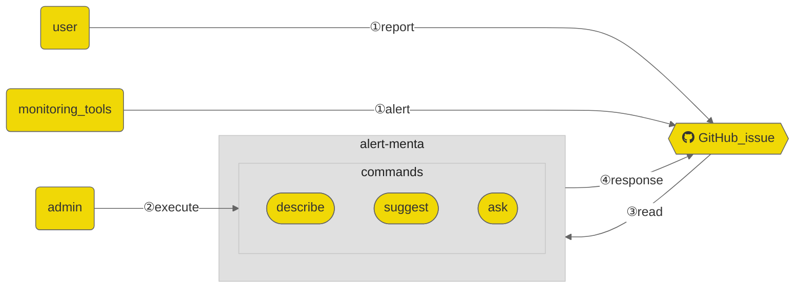

```mermaid
%%{init: {'theme': 'base', 'themeVariables': {
  'primaryColor': '#f0d806',
  'primaryTextColor': '#333333',
  'primaryBorderColor': '#666666',
  'lineColor': '#666666',
  'secondaryColor': '#f5f5f5',
  'tertiaryColor': '#e0e0e0',
  'edgeLabelBackground': '#ffffff',
  'handDrawn': true
}}}%%
flowchart LR
    user(user)
    monitoring_tools(monitoring_tools)
    GitHub_issue{{<i class="fa-brands fa-github"></i> GitHub_issue}}
    admin(admin)
    subgraph alert-menta
        subgraph commands
        describe([describe])
        suggest([suggest])
        ask([ask])
        end
    end


    user--->|①report|GitHub_issue
    monitoring_tools--->|①alert|GitHub_issue
    admin-->|②execute|commands
    GitHub_issue-->|③read|alert-menta
    alert-menta-->|④response|GitHub_issue
```